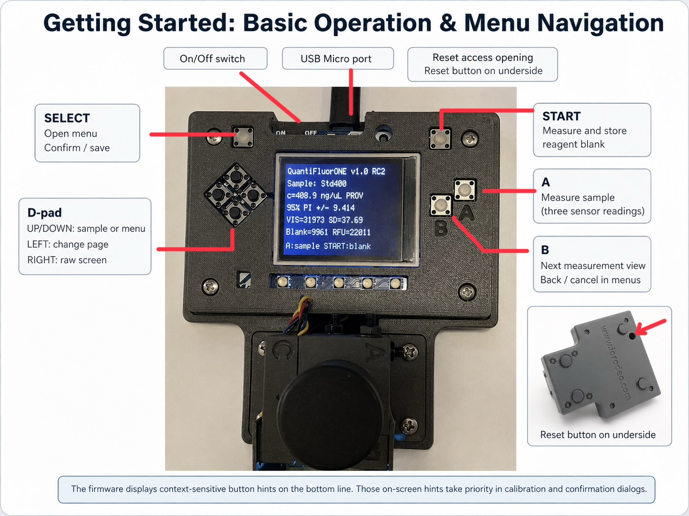

**Approximate time:** about 30 minutes

The purified PCR products are quantified before end repair so that the DNA input can be expressed in femtomoles using the representative amplicon length.

## Equipment and assay

- DIY-QuantiFluorONE dsDNA Fluorometer, Quantus® fluorometer, or another documented fluorometer
- QuantiFluor® ONE dsDNA reagent/system
- QuantiFluor® ONE Lambda DNA calibration standard, where required
- Compatible 0.5 mL clear reaction tubes
- Pipettes and clean filter tips
- Purified PCR products

**Instrument used:**  
<input class="protocol-input" data-field-id="quant-instrument" placeholder="e.g. DIY-QuantiFluorONE / Quantus">

The workshop assay uses **1 µL sample or standard + 200 µL QuantiFluor® ONE dsDNA reagent**. If another validated configuration is used, record the actual volumes and apply the same configuration consistently to blank, calibration and samples.

## DIY-QuantiFluorONE quick operation

The DIY-QuantiFluorONE dsDNA Fluorometer can be used for fluorometric quantification of the purified PCR products. It reports the concentration of the original DNA sample in ng/µL.

Documentation and source files: [DIY-QuantiFluorONE-dsDNA-Fluorometer repository](https://github.com/matthiasbirkich/diy-quantifluorone-dsdna-fluorometer)

### Front-panel controls

{fig-alt="QuantiFluorONE front-panel controls and menu-navigation functions"}

| Control | Main function |
|---|---|
| `SELECT` | Open the menu; confirm, load, or save the highlighted action |
| `START` | Measure and store the reagent blank; in calibration dialogs, measure the requested blank |
| `A` | Measure the selected sample; in two-point calibration, measure the high standard |
| `B` | Cycle measurement views; back or cancel in menus/dialogs |
| D-pad `UP/DOWN` | Select sample ID or menu item / standard concentration |
| D-pad `RIGHT` | Open or leave the RAW screen |
| D-pad `LEFT` | Change RAW page or calibration-result/status page |
| On/Off switch | Turn the instrument on or off |
| Reset access opening | Restart the PyBadge; also used for safe mode or UF2 bootloader entry |
| USB Micro port | Power, charging, programming, and file access |

The last line of the display shows context-sensitive button hints. These hints take priority whenever a calibration or confirmation dialog is open.

### Quick two-point calibration

- [ ] Allow the QuantiFluor® ONE dsDNA standard and reagent to reach room temperature before use.
- [ ] Switch on the DIY-QuantiFluorONE and allow approximately **20 min warm-up time** before the first quantitative measurement.
- [ ] During warm-up, prepare the reagent blank and the high calibration standard in compatible 0.5 mL tubes.
- [ ] Prepare the blank using **200 µL QuantiFluor® ONE dsDNA reagent**.
- [ ] Prepare the high standard using **200 µL QuantiFluor® ONE dsDNA reagent + 1 µL QuantiFluor® ONE Lambda DNA stock (400 ng/µL)** and mix thoroughly without introducing bubbles.
- [ ] Open the `SELECT` menu and select the **2-PT calibration** workflow.
- [ ] Insert the blank tube and press `START` to measure the calibration blank.
- [ ] Remove the blank and keep it protected from light.
- [ ] Insert the prepared high-standard tube.
- [ ] Confirm the standard step with `SELECT`.
- [ ] Press `A` to measure the high standard.
- [ ] Press `SELECT` to save the two-point calibration.
- [ ] Press `B` to return to the measurement screen.

Typical values observed for the validated instrument configuration are:

- calibration slope: approximately **114.5 ± 0.5**;
- raw reagent blank: approximately **6500-8500 counts**;
- 400 ng/µL standard: approximately **45,800 ± 500 RFU**.

These values are operational reference values rather than independent
acceptance limits. Because concentration calculation is based on the
active two-point calibration, a fresh reagent blank and the 400 ng/µL
standard should be measured whenever a new measurement session is
started or whenever optical or reagent conditions have changed.

Daily two-point calibration is recommended.

### Sample measurement

For each PCR product:

- [ ] Select the required sample ID using the D-pad `UP/DOWN` buttons.
- [ ] Prepare **200 µL QuantiFluor® ONE dsDNA reagent + 1 µL sample**.
- [ ] Mix thoroughly without introducing visible bubbles.
- [ ] Insert the tube into the instrument.
- [ ] Press `A` to measure the sample.
- [ ] Record the reported concentration together with the sample ID.
- [ ] Retain the measurement record together with the representative amplicon length used for the molar conversion.

If Quantus® or another fluorometer is used instead, follow its current validated assay/calibration procedure and record the instrument and calibration used.

## Conversion from DNA concentration to fmol

The amount of DNA in femtomoles depends on the length of the PCR product.

For double-stranded DNA, using an average molar mass of approximately

$$
660\ \mathrm{g\,mol^{-1}\,bp^{-1}},
$$

the molecular mass of an amplicon of length $L$ is approximately

$$
M = 660L\ \mathrm{g\,mol^{-1}}.
$$

For a DNA concentration $c$ in ng/µL and a DNA volume $V$ in µL:

$$
n_{\mathrm{fmol}}
=
\frac{c\,V\,10^6}{660L}.
$$

where:

- $n_{\mathrm{fmol}}$ = amount of DNA in fmol;
- $c$ = measured DNA concentration in ng/µL;
- $V$ = DNA volume in µL;
- $L$ = representative amplicon length in bp.

The DNA volume required for a selected molar amount is therefore:

$$
V
=
\frac{n_{\mathrm{fmol}}\,660L}{10^6c}.
$$

### Planning table

| Amplicon length | DNA mass for 100 fmol | DNA mass for 150 fmol | DNA mass for 200 fmol |
|---:|---:|---:|---:|
| 245 bp | 16.17 ng | 24.26 ng | 32.34 ng |
| 320 bp | 21.12 ng | 31.68 ng | 42.24 ng |
| 726 bp | 47.92 ng | 71.87 ng | 95.83 ng |
| 1000 bp | 66.00 ng | 99.00 ng | 132.00 ng |
| 2000 bp | 132.00 ng | 198.00 ng | 264.00 ng |

Thus, for a 726-bp amplicon,

$$
48\ \mathrm{ng} \approx 100\ \mathrm{fmol}.
$$

This relationship is specific to a fragment close to 726 bp. SHARK-Seq uses products of different lengths, so the representative fragment length must be used for each preparation.

## Open-validation uncertainty estimate

As part of the open-validation concept, a conservative upper-bound uncertainty can be estimated transparently from the observed session-to-session variation of the raw reagent blank.

For the validated instrument configuration, a calibration slope of approximately

$$
b = 114.7 \pm 0.5\ \mathrm{RFU}\,(\mathrm{ng}/\mu\mathrm{L})^{-1}
$$

was observed. Historical raw blank values were approximately **6000-9000 counts**.

Using half of this observed range as a conservative estimate,

$$
\Delta B \approx \pm1500\ \mathrm{counts},
$$

the corresponding concentration deviation is

$$
\Delta c
=
\frac{\Delta B}{b}
\approx
\frac{1500}{114.7}
\approx
\pm13.1\ \mathrm{ng}/\mu\mathrm{L}.
$$

For a **726-bp dsDNA amplicon** and a DNA volume of $V=1$ µL,

$$
\Delta n_{\mathrm{fmol}}
=
\frac{\Delta c\,10^6}{660 \times 726}
\approx
\pm27\ \mathrm{fmol}.
$$

Thus, for a 726-bp amplicon, the historical session-to-session blank variation corresponds to a conservative estimated uncertainty of approximately **±25-30 fmol**.

::: {.callout-note}
This is an openly documented **operational upper-bound estimate**, not a universal instrument uncertainty or a formal expanded uncertainty with a stated coverage factor. The corresponding molar uncertainty changes with amplicon length. A current reagent blank should therefore always be measured for quantitative work.
:::

## Measurement record

**Sample ID:** <input class="protocol-input" data-field-id="quant-sample-id" placeholder="sample ID">  
**Measured concentration:** <input class="protocol-input" data-field-id="quant-conc" placeholder="ng/µL">  
**Amplicon length used for calculation:** <input class="protocol-input" data-field-id="quant-length" placeholder="bp">  
**Target amount:** <input class="protocol-input" data-field-id="quant-target" placeholder="fmol">  
**Calculated aliquot volume:** <input class="protocol-input" data-field-id="quant-volume" placeholder="µL">

- [ ] Retain concentration, fragment length, target fmol and calculated volume together in the sample record.
- [ ] If the calculated transfer volume is impractically small, prepare and document a suitable dilution.

### My notes
<textarea class="protocol-notes" data-note-id="quantification"></textarea>
