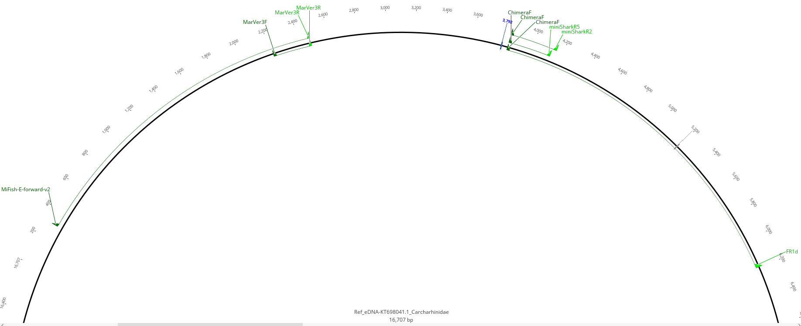
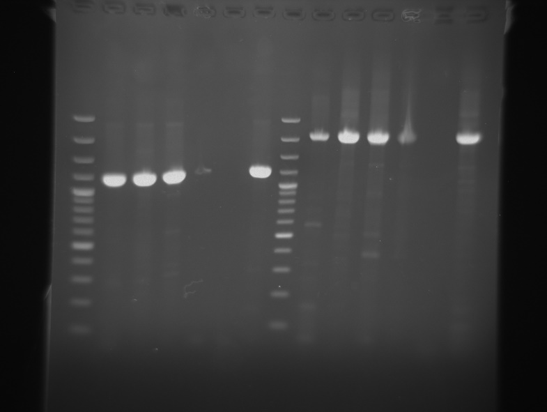

## Purpose

This site provides the current bench-oriented protocol for the SHARK-Seq workshop.

The protocol deliberately distinguishes three kinds of information:

- **fixed procedure** - a step currently specified for the workshop;
- **calculated starting condition** - for example, an annealing temperature calculated for a defined primer/polymerase combination;
- **workshop-selected condition** - a primer variant, annealing temperature, pooling scheme or other choice that must be recorded when the workshop team makes the final decision.

::: {.callout-important}
## Current status
This is a **workshop-ready draft**, not a claim that every SHARK-Seq PCR has already been experimentally optimized. Primer identity, final annealing temperature and the long-reference amplicon lengths must be recorded for the actual workshop material.
:::

## Workflow

1. **Reference DNA PCR** - long mitochondrial reference amplicons using Q5 High-Fidelity 2X Master Mix.
2. **eDNA PCR** - short mitochondrial markers using Phusion Hot Start Flex 2X Master Mix.
3. **PCR product check** by agarose gel electrophoresis.
4. **PCR clean-up** with magnetic beads.
5. **dsDNA quantification** and conversion from ng to fmol using the actual amplicon length.
6. **End repair and clean-up**.
7. **Ligation-adaptor ligation**.
8. **Flongle priming and loading**.
9. **MinKNOW sequencing run**.
10. **Read processing / sequence identification**.

## Why two PCR branches?

The reference-DNA branch aims to obtain relatively long mitochondrial reference sequences from known DNA. The eDNA branch uses short markers because environmental DNA is often fragmented. The workshop therefore treats reference-library generation and environmental detection as complementary tasks.


## External primer tools


[Official NEB Tm Calculator](https://tmcalculator.neb.com/)
[Independent open reproduction (GitHub)](https://github.com/Dioskurides/polymerase-tm)


Both tools are also available as permanent navigation tabs at the top of the site.

\newpage

# 1 Reference DNA PCR

**Polymerase:** Q5® High-Fidelity 2X Master Mix (NEB M0492)  
**Purpose:** generate long mitochondrial reference amplicons from known reference DNA.

## Primer pairs under consideration


**Reference PCR A - primer choice open**  
Forward: workshop-selected MiFish forward variant  
Reverse: MarVer3R `GGATTGCGCTGTTATCCC`  
Starting Ta: calculate after the forward-primer sequence is selected.

**Reference PCR A - short candidate**  
Forward: MiFish-U-F `GTCGGTAAAACTCGTGCCAGC`  
Reverse: MarVer3R `GGATTGCGCTGTTATCCC`  
Calculated starting Ta: **65 °C**.

**Reference PCR B**  
Forward: ChimeraF `AAGGACTACTTTGATAGAGT`  
Reverse: FR1d `CACCTCAGGGTGTCCGAARAAYCARAA`  
Calculated starting Ta: **57 °C**.

*Calculated starting values assume Q5 High-Fidelity 2X Master Mix and 0.5 µM of each primer. Critical runs should be checked with the official NEB Tm Calculator. Final workshop conditions should be recorded below.

::: {.callout-note}
The planning material explicitly raises the possibility of using the shorter MiFish-U-F sequence to make a common temperature near 60 °C practical. The present protocol therefore treats primer choice as a **documented workshop decision**, not as a pre-set fact.
:::

## Primer-selection decision


**Reference PCR A - forward primer selected**

___________________________(Short MiFish-U-F: GTCGGTAAAACTCGTGCCAGC / Alternative MiFish forward primer)

**Exact forward-primer sequence used (5'-3')**  
______________________________

**NEB-calculated starting Ta**  
______________________________

**Actual workshop Ta**  
______________________________


{fig-alt="Primer binding overview supplied by the workshop team" width=95%}

## Recommended calculation workflow

- [ ] Open the [official NEB Tm Calculator](https://tmcalculator.neb.com/).
- [ ] Select the Q5 High-Fidelity 2X Master Mix product corresponding to M0492.
- [ ] Set primer concentration to **500 nM** unless the workshop lead specifies another concentration.
- [ ] Enter the exact forward and reverse primer sequences.
- [ ] Record the calculated annealing temperature.
- [ ] If a different MiFish forward variant is selected, recalculate before preparing the thermocycler program.
- [ ] Record the actual temperature used and whether amplification was successful.

The same calculation can be independently checked with [Dioskurides/polymerase-tm](https://github.com/Dioskurides/polymerase-tm).

## PCR reaction setup

Use the current NEB protocol for Q5 High-Fidelity 2X Master Mix as the manufacturer reference. The following table is a **starting worksheet**, because template volume/concentration and final reaction volume have not yet been fixed for the workshop.

| Component | Workshop value |
|---|---:|
| Q5 High-Fidelity 2X Master Mix | ____ µL |
| Forward primer | ____ µL; final ____ µM |
| Reverse primer | ____ µL; final ____ µM |
| Template DNA | ____ µL |
| Nuclease-free water | to ____ µL |
| **Total reaction volume** | **____ µL** |

::: {.callout-important}
Use the primer/polymerase-specific Q5 calculation for the selected primer pair. A common 60 °C trial can be recorded as an experimental workshop choice, but it is not the calculated optimum for both planned Q5 primer pairs.
:::

## Cycling worksheet

| Step | Temperature | Time | Cycles |
|---|---:|---:|---:|
| Initial denaturation | 98 °C | ____ | 1 |
| Denaturation | 98 °C | ____ | ____ |
| Annealing - Reference PCR A | **workshop-selected** | ____ | repeat |
| Annealing - Reference PCR B | **57 °C calculated start** | ____ | repeat |
| Extension | 72 °C | set from expected amplicon length | repeat |
| Final extension | 72 °C | ____ | 1 |
| Hold | 4-15 °C | hold | - |

## Long-reference amplicon length

The exact lengths of the two long reference amplicons **cannot be fixed without the actual reference species / mitochondrial sequence**. During preparation or the workshop, map both primers to the relevant mitochondrial reference sequence and record:

| PCR | Species / reference | accession / sequence source | expected amplicon |
|---|---|---|---:|
| Reference A | __________ | __________ | ____ bp |
| Reference B | __________ | __________ | ____ bp |

- [ ] Record reference species / sample identity.
- [ ] Record the primer variant actually used.
- [ ] Record predicted amplicon length.
- [ ] Include NTC and positive control where appropriate.
- [ ] Keep reactions chilled during setup.
- [ ] Run PCR under the selected program.
- [ ] Store PCR product at 4 °C for short-term use or according to the local laboratory procedure.

### My notes


________________________________________________________________________________

________________________________________________________________________________

________________________________________________________________________________

\newpage

# 2 eDNA PCR

**Polymerase:** Phusion™ Hot Start Flex 2X Master Mix (NEB M0536)  
**Purpose:** amplify short mitochondrial markers suitable for potentially fragmented environmental DNA.

## Primer systems


**eDNA 1 - MarVer3**  
Target: marine vertebrate 16S; expected product: ~245 bp average.  
Forward: MarVer3F `AGACGAGAAGACCCTRTG`  
Reverse: MarVer3R `GGATTGCGCTGTTATCCC`  
Calculated starting Ta: **58-61 °C**.

**eDNA 2 - miniSharkR5**  
Target: short NADH2 marker for sharks; expected product: ~320 bp.  
Forward: ChimeraF `AAGGACTACTTTGATAGAGT`  
Reverse: miniSharkR5 `CCTATTCAAACTAGGAGTC`  
Calculated starting Ta: **55 °C**.

**eDNA 3 - miniSharkR2**  
Target: short NADH2 marker for sharks and rays; expected product: ~320 bp.  
Forward: ChimeraF `AAGGACTACTTTGATAGAGT`  
Reverse: miniSharkR2 `GGAATRATGGCTAATGTGTT`  
Calculated starting Ta: **56 °C**.

*Calculated starting values assume Phusion Hot Start Flex 2X Master Mix and 0.5 µM of each primer. Degenerate bases create more than one possible oligonucleotide sequence; therefore a range is shown for MarVer3.

## Workshop decision

A common temperature can be convenient operationally, but it must not be presented as calculated optimum unless it is supported by the actual primer pair.

| PCR | Calculated start | Actual workshop Ta | Result |
|---|---:|---:|---|
| MarVer3F / MarVer3R | 58-61 °C | ____ °C | [ ] success [ ] weak [ ] no product |
| ChimeraF / miniSharkR5 | 55 °C | ____ °C | [ ] success [ ] weak [ ] no product |
| ChimeraF / miniSharkR2 | 56 °C | ____ °C | [ ] success [ ] weak [ ] no product |

## Reaction setup worksheet

Use the current NEB Phusion Hot Start Flex 2X Master Mix protocol as the manufacturer reference. The supplied workshop source does not specify the final SHARK-Seq reaction volume or template input, so record the actual values here.

| Component | Workshop value |
|---|---:|
| Phusion Hot Start Flex 2X Master Mix | ____ µL |
| Forward primer | ____ µL; final ____ µM |
| Reverse primer | ____ µL; final ____ µM |
| eDNA template | ____ µL |
| Nuclease-free water | to ____ µL |
| **Total reaction volume** | **____ µL** |

## Cycling worksheet

| Step | Temperature | Time | Cycles |
|---|---:|---:|---:|
| Initial denaturation | 98 °C | ____ | 1 |
| Denaturation | 98 °C | ____ | ____ |
| Annealing | see primer table / workshop decision | ____ | repeat |
| Extension | 72 °C | appropriate for ~245-320 bp | repeat |
| Final extension | 72 °C | ____ | 1 |
| Hold | 4-15 °C | hold | - |

- [ ] Prepare an NTC for each relevant PCR master mix.
- [ ] Add positive control material where the workshop plan provides one.
- [ ] Keep pre-PCR reagents and amplified products physically separated according to local laboratory practice.
- [ ] Record primer pair, polymerase lot, template ID and actual Ta.
- [ ] Run PCR.
- [ ] Proceed to PCR product check.

### My notes


________________________________________________________________________________

________________________________________________________________________________

________________________________________________________________________________

\newpage

# Primer Tools and Annealing-Temperature Calculations

## Official calculator


[Open official NEB Tm Calculator](https://tmcalculator.neb.com/)


Use this tool as the primary reference for workshop calculations. Select the exact polymerase/kit, confirm primer concentration and enter the exact 5'-3' sequences.

## Independent open reproduction


[Open polymerase-tm on GitHub](https://github.com/Dioskurides/polymerase-tm)


`polymerase-tm` is an independent MIT-licensed Python implementation that documents NEB-compatible Tm/Ta calculation logic and can be used as a reproducibility / cross-check tool. It is not affiliated with NEB; critical workshop values should be checked against the official calculator.

## Current calculation table

| Primer pair | Polymerase | Calculated starting Ta |
|---|---|---:|
| short MiFish-U-F / MarVer3R | Q5 High-Fidelity 2X | **65 °C** |
| ChimeraF / FR1d | Q5 High-Fidelity 2X | **57 °C** |
| MarVer3F / MarVer3R | Phusion Hot Start Flex 2X | **58–61 °C** |
| ChimeraF / miniSharkR5 | Phusion Hot Start Flex 2X | **55 °C** |
| ChimeraF / miniSharkR2 | Phusion Hot Start Flex 2X | **56 °C** |

## Reproducible local calculation

The repository includes `tools/primer_calculations.csv` and an optional script `tools/calculate_annealing.py`. After installing the independent package:

```bash
python -m pip install polymerase-tm
python tools/calculate_annealing.py
```

The script is a convenience cross-check only; the **official NEB calculator remains the primary manufacturer tool**.

## Temperature terminology

- **Calculated starting Ta:** value obtained from a defined calculator/polymerase/primer setup.
- **Workshop-selected Ta:** temperature actually programmed during the workshop.
- **Validated Ta:** condition shown experimentally to provide the required specific product under the documented setup.

Do not silently promote a calculated value to “validated”.

\newpage

# 3 PCR Product Check by Agarose Gel Electrophoresis

**Approximate time:** about 2 hours

SHARK-Seq contains both short (~245-320 bp) and long reference products. Gel concentration, marker range, voltage and run time should therefore be selected for the product-size question being asked and recorded with the gel image.

## Material

### Equipment and tools

- Electrophoresis box with power supply
- Gel casting tray and comb
- Microwave-safe flask or beaker
- UV transilluminator or suitable gel imaging system
- Balance
- Microwave
- 20 µL pipette
- Camera or smartphone

### Consumables and reagents

- Gloves and suitable eye/UV protection
- Pipette tips
- 1X TAE buffer
- Agarose powder
- DNA stain used by the laboratory
- Molecular-weight marker / DNA ladder covering the relevant size range
- DNA loading dye
- PCR products and controls

## Gel plan

**Gel concentration actually used:** ______________________________  
**Voltage / run time:** ______________________________  
**Expected size(s):** ______________________________

## Instructions

- [ ] Select a gel concentration and molecular-weight marker suitable for the expected product sizes.
- [ ] Prepare agarose in 1X TAE buffer and heat until completely dissolved.
- [ ] Allow the solution to cool sufficiently and add the laboratory's DNA stain according to its instructions.
- [ ] Cast the gel with the required comb and allow it to solidify.
- [ ] Place the gel in the electrophoresis chamber and cover with 1X TAE.
- [ ] Load the molecular-weight marker.
- [ ] Mix the selected PCR products with loading dye and load the gel.
- [ ] Include the relevant negative and positive PCR controls.
- [ ] Run under the recorded voltage/time conditions.
- [ ] Visualize and photograph the gel.
- [ ] Compare each band with the expected or predicted product size.
- [ ] Record non-specific bands, primer dimers, weak amplification, smear or bands in the negative control.
- [ ] For long reference PCRs, do not call the product length "exact" solely from gel migration; use in-silico mapping when the reference sequence becomes available.

{fig-alt="Development agarose gel with DNA bands from prior primer testing" width=75%}

### Gel observations


________________________________________________________________________________

________________________________________________________________________________

________________________________________________________________________________

\newpage

# 4 PCR Clean-up

**Approximate time:** about 1.5 hours

The current draft uses CleanPCR magnetic beads at a **1.8X bead-to-PCR volume ratio**. Because SHARK-Seq contains both short eDNA products and long reference products, the workshop team should confirm that this ratio is appropriate for the fragments that must be retained.

## Equipment

- Hula mixer / gentle rotator
- Vortex mixer and microfuge
- Magnetic stand suitable for 1.5 mL tubes
- Multichannel pipette where applicable
- 1000, 200, 20 and small-volume pipettes as required

## Reagents

- CleanPCR® magnetic beads or workshop-specified equivalent
- Freshly prepared 75% ethanol
- Nuclease-free water

::: {.callout-warning}
## Pooling decision required
The final indexing/barcoding and pooling scheme has not yet been specified. **Do not pool samples until the workshop sample sheet or indexing strategy confirms that pooling is appropriate.**
:::

**Pooling / clean-up plan used**  
______________________________ (Clean individually / Pool indexed PCR products before clean-up / Pool after individual clean-up / Other - document in notes)

## Bead-ratio worksheet

| PCR volume | CleanPCR volume at 1.8X |
|---:|---:|
| 10 µL | 18 µL |
| 20 µL | 36 µL |
| 40 µL | 72 µL |
| 50 µL | 90 µL |

**PCR volume cleaned:** ______________________________  
**Bead volume used:** ______________________________  
**Bead ratio used:** ______________________________

## Instructions

- [ ] Pool or select PCR products according to the current SHARK-Seq sample sheet and record every contribution.
- [ ] Vortex/resuspend CleanPCR beads before use.
- [ ] Add the selected bead volume to the PCR product.
- [ ] Mix and incubate on a gentle rotator for 5 min; briefly spin down.
- [ ] Place on magnet until the supernatant clears.
- [ ] Remove supernatant without disturbing beads.
- [ ] Wash with 200 µL 75% ethanol without resuspending the pellet; incubate for about 1 min.
- [ ] Remove ethanol and repeat for a second wash.
- [ ] Remove residual ethanol carefully.
- [ ] Air dry sufficiently to remove ethanol, but avoid excessive over-drying.
- [ ] Remove from magnet and add the workshop-defined elution volume of nuclease-free water (30 µL is the current draft value).
- [ ] Resuspend thoroughly, incubate briefly at room temperature, return to the magnet and transfer the clear eluate to a clean labelled tube.

### My notes


________________________________________________________________________________

________________________________________________________________________________

________________________________________________________________________________

\newpage

# 5 dsDNA Quantification and fmol Calculation

**Approximate time:** about 30 minutes

Use the workshop's validated fluorometric method (for example, Quantus with the QuantiFluor® ONE protocol or another documented fluorometer). Measure a current reagent blank as required by the instrument/method.

## Equipment and assay

- Fluorometer used by the workshop
- QuantiFluor® ONE dsDNA reagent/system or the specified assay
- Calibration standard(s) required by the method
- 0.5 mL clear reaction tubes compatible with the method
- Pipettes and clean filter tips
- Purified PCR products

**Instrument used:**  
______________________________

## Measurement

The current assay worksheet uses **200 µL QuantiFluor® ONE dsDNA reagent + 1 µL sample**. If another validated assay configuration is used, record the actual volumes and apply that configuration consistently to blank, calibration and samples.

- [ ] Confirm that the fluorometer calibration/QC status is acceptable for the intended measurement.
- [ ] Prepare and measure a current reagent blank according to the instrument method.
- [ ] Add 200 µL QuantiFluor® ONE dsDNA reagent to a clean compatible tube, unless the active method specifies another volume.
- [ ] Add 1 µL unknown sample, unless the active method specifies another sample volume.
- [ ] Mix consistently and protect from light.
- [ ] Measure and record the dsDNA concentration in ng/µL.

## Convert ng to fmol using the actual amplicon length

For dsDNA using approximately 660 g mol^-1 per base pair:

$$
\mathrm{fmol}=\frac{c\,[\mathrm{ng}/\mu\mathrm{L}]\times V\,[\mu\mathrm{L}]\times10^6}{660\times L\,[\mathrm{bp}]}
$$

For a target molar amount:

$$
V\,[\mu\mathrm{L}]=\frac{n\,[\mathrm{fmol}]\times660\times L\,[\mathrm{bp}]}{10^6\times c\,[\mathrm{ng}/\mu\mathrm{L}]}
$$

### Practical planning range

The current end-prep worksheet uses approximately **100-200 fmol** of amplicon DNA. A useful mid-range planning value is **150 fmol**, but the actual target should be confirmed for the library-preparation kit used at the workshop.

| Example fragment length | DNA mass for 100 fmol | DNA mass for 150 fmol | DNA mass for 200 fmol |
|---:|---:|---:|---:|
| 245 bp | 16.2 ng | 24.3 ng | 32.3 ng |
| 320 bp | 21.1 ng | 31.7 ng | 42.2 ng |
| 1000 bp | 66.0 ng | 99.0 ng | 132.0 ng |
| 2000 bp | 132.0 ng | 198.0 ng | 264.0 ng |

::: {.callout-important}
SHARK-Seq uses different fragment lengths. Always use the **representative fragment length of the product actually being prepared** rather than one fixed ng-to-fmol shortcut.
:::

**Sample concentration:** ______________________________  
**Amplicon length used for calculation:** ______________________________  
**Target:** ______________________________  
**Calculated aliquot volume:** ______________________________

- [ ] Retain concentration, fragment length, target fmol and calculated volume together in the sample record.
- [ ] If the calculated transfer volume is impractically small, prepare and document a suitable dilution.

### My notes


________________________________________________________________________________

________________________________________________________________________________

________________________________________________________________________________

\newpage

# 6 End Repair and Clean-up

**Approximate time:** about 1 hour

The current workshop draft follows a Ligation Sequencing Kit V14-era end-prep workflow. Check the current Oxford Nanopore kit instructions before the workshop and record any changes.

## Equipment and reagents

- Gentle rotator / Hula mixer
- Magnetic stand, microfuge, vortex mixer, thermal cycler
- 1000, 200, 20 and small-volume pipettes
- 0.2 mL PCR tubes and 1.5 mL DNA LoBind tubes
- Ice bucket
- Nuclease-free water
- Freshly prepared 80% ethanol
- NEBNext Ultra II End Prep Reaction Buffer
- NEBNext Ultra II End Prep Enzyme Mix
- AXP magnetic beads from the supplied ligation sequencing kit
- Purified amplicon DNA

## Input amount

**Planning range:** approximately **100-200 fmol** of amplicon DNA.  
**Actual amount selected:** ______________________________  
**Representative fragment length:** ______________________________

::: {.callout-important}
Calculate the DNA volume from the measured dsDNA concentration and the representative fragment length. Record the actual amount used rather than relying on a fixed mass value.
:::

## End-prep reaction

- [ ] Thaw End Prep Reaction Buffer and AXP beads at room temperature, mix as required and place on ice.
- [ ] Thaw End Prep Enzyme Mix on ice; mix gently by flicking or pipetting. Do not vortex the enzyme mix.
- [ ] Calculate the DNA volume needed for the selected fmol input.
- [ ] Bring the selected DNA input to **25 µL** with nuclease-free water.
- [ ] Add **3.5 µL** Ultra II End Prep Reaction Buffer.
- [ ] Add **1.5 µL** Ultra II End Prep Enzyme Mix.
- [ ] Mix gently and spin down briefly.
- [ ] Incubate **20 °C for 5 min** and **65 °C for 5 min**.

## Bead clean-up

- [ ] Resuspend AXP beads.
- [ ] Transfer the 30 µL end-prep reaction to a 1.5 mL tube.
- [ ] Add **30 µL AXP beads** and mix by flicking.
- [ ] Incubate on a gentle rotator for 5 min at room temperature.
- [ ] Prepare fresh 80% ethanol.
- [ ] Pellet beads on magnet until supernatant is clear; remove supernatant.
- [ ] Wash twice with **200 µL fresh 80% ethanol** without disturbing the pellet.
- [ ] Remove residual ethanol and dry briefly without cracking the pellet.
- [ ] Resuspend in **31 µL nuclease-free water**; incubate about 2 min at room temperature.
- [ ] Pellet on magnet and transfer 31 µL clear eluate to a clean DNA LoBind tube.
- [ ] Keep on ice and quantify yield if required before adaptor ligation.

### My notes


________________________________________________________________________________

________________________________________________________________________________

________________________________________________________________________________

\newpage

# 7 Ligation-Adaptor Ligation

**Approximate time:** about 1 hour

The volumes below represent the current workshop draft for a V14-era ligation workflow. Confirm reagent names and volumes against the kit actually supplied.

## Materials

- NEBNext Quick T4 DNA Ligase (E6056 or workshop-equivalent)
- Ligation Adapter (LA), Ligation Buffer (LNB), Elution Buffer (EB)
- AXP magnetic beads and Short Fragment Buffer (SFB)
- 30 µL end-repaired PCR product
- Magnetic rack, microfuge, vortex mixer, gentle rotator
- 200, 20 and small-volume pipettes

## Instructions

- [ ] Spin down Ligation Adapter and T4 ligase; place on ice.
- [ ] Thaw Ligation Buffer at room temperature, spin down and mix thoroughly by pipetting; place on ice.
- [ ] Thaw Elution Buffer at room temperature, vortex, spin down and place on ice.
- [ ] Mix in this order: **30 µL end-prepped DNA + 12.5 µL Ligation Buffer + 5 µL T4 DNA Ligase + 2.5 µL Ligation Adapter**.
- [ ] Mix gently by pipetting and briefly spin down.
- [ ] Incubate for 10 min at room temperature.
- [ ] Resuspend AXP beads and add **20 µL** to the reaction.
- [ ] Mix by flicking; incubate on gentle rotator for 5 min at room temperature.
- [ ] Pellet on magnet until clear and remove supernatant slowly.
- [ ] Wash with **125 µL SFB**, resuspending by flicking.
- [ ] Return to magnet; remove supernatant and repeat the SFB wash.
- [ ] Remove residual liquid and dry beads briefly without over-drying.
- [ ] Resuspend in **7 µL EB** and incubate 10 min at room temperature.
- [ ] Pellet on magnet and transfer the clear eluate containing the DNA library to a clean tube.
- [ ] Quantify the final library if required.

## Library amount for loading

The current draft uses approximately **10 fmol in 5 µL** as a planning target for Flongle loading. Confirm the final loading amount against the current Oxford Nanopore kit / flow-cell guidance before the workshop.

**Actual loading target:** ______________________________

### My notes


________________________________________________________________________________

________________________________________________________________________________

________________________________________________________________________________

\newpage

# 8 Priming and Loading the Flongle

**Approximate time:** less than 1 hour

::: {.callout-important}
Oxford Nanopore kit formulations and loading instructions can change. Verify the kit and flow-cell identifiers against the material actually supplied for the workshop before using the draft volumes below.
:::

## Materials

- MinION device and Flongle adapter
- Flongle Flow Cell (current planning identifier: FLO-FLG114; verify supplied flow cell)
- Sequencing Buffer (SB)
- Library Beads (LIB)
- Flow Cell Tether (FCT)
- Flow Cell Flush (FCF)
- Prepared DNA library
- 1.5 mL tube, suitable pipettes and filter tips

## Current draft workflow

- [ ] Confirm the current Oxford Nanopore protocol, kit identifier and Flongle identifier before starting.
- [ ] Thaw SB, LIB, FCT and FCF at room temperature according to current kit guidance.
- [ ] Mix, spin down and store as required by the current kit instructions.
- [ ] If confirmed for the supplied kit, prepare the priming mix with **117 µL FCF + 3 µL FCT** and mix by pipetting.
- [ ] Insert the Flongle adapter into the powered MinION before inserting the flow cell.
- [ ] Insert the Flongle flow cell securely.
- [ ] Open the sample port without touching the flow-cell array or adapter contacts.
- [ ] Prime carefully, avoiding air gaps and forceful dispensing.
- [ ] Mix Library Beads (LIB) immediately before preparing the sequencing mix.
- [ ] If confirmed for the supplied kit, prepare the sequencing mix with **15 µL SB + 10 µL LIB + 5 µL DNA library**.
- [ ] Load without introducing air bubbles or air gaps.
- [ ] Seal the flow cell as specified by the current device instructions.
- [ ] Close the device lid and proceed to MinKNOW.

**Current ONT protocol checked on (date/version/link):**  
______________________________

**Any volume/procedure changes from this draft:**  


________________________________________________________________________________

________________________________________________________________________________

________________________________________________________________________________


### My notes


________________________________________________________________________________

________________________________________________________________________________

________________________________________________________________________________

\newpage

# 9 Set Up the Sequencing Run with MinKNOW

**Approximate time:** less than 1 hour for setup

The current draft assumes a V14-era ligation workflow and SUP basecalling as starting choices. The **actual MinKNOW version, kit and basecalling model available at the workshop take precedence**.

## Requirements

- MinION with loaded Flongle
- Stable power supply
- Network access as required for the workstation/software configuration
- Current MinKNOW installation and appropriate permissions

## Instructions

- [ ] Open MinKNOW and select the connected device.
- [ ] Run the **Flow Cell Health Check**.
- [ ] Record the available pores and apply the current Oxford Nanopore guidance and workshop acceptance rule.
- [ ] Start a new sequencing experiment and select the correct Flongle flow cell.
- [ ] Select the kit corresponding to the actual library preparation.
- [ ] Select the basecalling model / accuracy mode specified for the workshop.
- [ ] Confirm output path, live basecalling and read-filter settings.
- [ ] Record the run name so it matches the laboratory sample/pool IDs.
- [ ] Start sequencing.
- [ ] Monitor active pores, data yield and read quality.
- [ ] Record any change from the planned settings or any run interruptions.

**MinKNOW version:** ______________________________  
**Flow cell / run ID:** ______________________________  
**Kit selected:** ______________________________  
**Basecalling model:** ______________________________

### My notes


________________________________________________________________________________

________________________________________________________________________________

________________________________________________________________________________

\newpage

# 10 Sequence Processing and Identification

The final SHARK-Seq analysis path depends on whether the data are long reference amplicons, short eDNA markers, indexed pools, or a combination of these. Record the actual analysis route rather than assuming one universal target length or software setting.

## Preserve raw output

- [ ] Record the MinKNOW output directory and run identifier.
- [ ] Preserve the original sequencing output before manual processing.
- [ ] Keep sample/pool metadata, primer pair, PCR Ta and expected amplicon length linked to the sequencing run.

## FASTQ handling

- [ ] Locate the sequencing FASTQ / FASTQ.GZ output.
- [ ] Merge files only if this is appropriate for the selected analysis software and file organization.
- [ ] Do not overwrite the original read files.
- [ ] Record all commands or software versions used to combine, filter or demultiplex reads.

Example Windows command for concatenating gzip-compressed FASTQ files when appropriate:

```text
cmd /c "type *.fastq.gz > merged.fastq.gz"
```

## ONTbarcoder path - where applicable

ONTbarcoder remains available at: <https://github.com/asrivathsan/ONTbarcoder>

- [ ] Confirm that ONTbarcoder is appropriate for the specific SHARK-Seq library/pool.
- [ ] Load the relevant FASTQ and demultiplexing/sample information according to the selected workflow.
- [ ] Enter a target length appropriate to the **actual amplicon**.
- [ ] Store results in a clearly named output directory linked to the run ID.
- [ ] Retain consensus FASTA sequences and quality/output reports.

## Dataset and analysis record

**Dataset type:**  
______________________________ (Long reference amplicons / MarVer3 eDNA / miniSharkR2 eDNA / miniSharkR5 eDNA / Mixed / other)

**Expected fragment length / range:** ______________________________  
**Demultiplexing / index scheme:** ______________________________  
**Analysis software / version / parameters:** ______________________________  
**Identification database / method:** ______________________________

## Sequence identification

The [GBIF Sequence ID tool](https://www.gbif.org/tools/sequence-id) can be used for a rapid identity check where appropriate. For SHARK-Seq, record the reference database and identification criteria actually used, especially when comparing environmental sequences with newly generated long reference amplicons.

- [ ] Confirm that sequence orientation and target marker are appropriate for the selected identification tool.
- [ ] Record top matches together with alignment/identity evidence rather than recording only a species name.
- [ ] Keep reference-library sequences distinguishable from environmental sequences.
- [ ] Document ambiguous or conflicting identifications for group discussion.

::: {.callout-warning}
The final demultiplexing and taxonomic-assignment workflow for all new primer sets is still a workshop decision. Record the actual method, target length and software settings used.
:::

### My notes


________________________________________________________________________________

________________________________________________________________________________

________________________________________________________________________________

\newpage

# Workshop Decisions and Open Items

This page collects parameters that must be confirmed before or during SHARK-Seq. It is intentionally visible rather than hiding unresolved details in the prose.

| Item | Current basis | Decision / value |
|---|---|---|
| Reference PCR A forward primer | MiFish forward not yet fixed; short MiFish-U-F is a candidate | __________ |
| Reference PCR A Ta | 65 °C calculated for short MiFish-U-F / MarVer3R | __________ °C |
| Reference PCR B Ta | 57 °C calculated for ChimeraF / FR1d | __________ °C |
| MarVer3 Ta | 58-61 °C calculated starting range | __________ °C |
| miniSharkR5 Ta | 55 °C calculated start | __________ °C |
| miniSharkR2 Ta | 56 °C calculated start | __________ °C |
| Long reference species / sequences | not provided | __________ |
| Long reference amplicon lengths | species-dependent | __________ bp |
| PCR reaction volumes/template input | not provided | __________ |
| Index/barcode strategy | not provided | __________ |
| PCR pooling strategy | not yet specified | __________ |
| PCR clean-up bead ratio | current draft 1.8X; verify retention needs | __________ X |
| End-prep input | planning range 100-200 fmol | __________ fmol |
| Final library loading target | current draft ~10 fmol; verify supplied kit | __________ fmol |
| ONT kit / Flongle version | verify supplied kit | __________ |
| MinKNOW / basecalling model | verify current setup | __________ |
| Final analysis workflow | not fully specified | __________ |

## Definition of status

**Calculated** does not mean experimentally optimized.  
**Workshop-selected** records what was actually used.  
**Validated** should only be used after the documented reaction has produced the intended specific product under the stated conditions.

\newpage

# References and Source Links

## Workshop source material

- *Hands on MinION: Generating reference data for West African marine pelagic fish*. WAMBA-net summer school training, University Abidjan, September 2024. Workshop handout supplied by the workshop team.
- *Primer-Ref-lib-result.docx*. Working notes / primer and reference-library material supplied for the SHARK-Seq adaptation, August 2026.

## Primer and eDNA literature

- Valsecchi E, et al. 2020. *Novel universal primers for metabarcoding environmental DNA surveys of marine mammals and other marine vertebrates*. Environmental DNA. DOI: 10.1002/edn3.72.
- Leurs G, et al. 2023. *Addressing data-deficiency of threatened sharks and rays in a highly dynamic coastal ecosystem using environmental DNA*. Ecological Indicators 154:110795. DOI: 10.1016/j.ecolind.2023.110795.
- Ivanova NV, Zemlak TS, Hanner RH, Hebert PDN. 2007. *Universal primer cocktails for fish DNA barcoding*. Molecular Ecology Notes 7:544–548. DOI: 10.1111/j.1471-8286.2007.01748.x.
- Miya M, Nishida M. 2015. *The mitogenomic contributions to molecular phylogenetics and evolution of fishes: a 15-year retrospect*. Ichthyological Research 62:29–71. DOI: 10.1007/s10228-014-0440-9.
- de la Hoz Schilling C, et al. 2024. *eDNA metabarcoding reveals a rich but threatened and declining elasmobranch community in West Africa’s largest marine protected area, the Banc d’Arguin*. Conservation Genetics 25:805–821. DOI: 10.1007/s10592-024-01604-y.

## Manufacturer and software links

- Official NEB Tm Calculator: <https://tmcalculator.neb.com/>
- Q5 High-Fidelity 2X Master Mix M0492 protocol: <https://www.neb.com/en-us/protocols/protocol-for-q5-high-fidelity-2x-master-mix-m0492>
- Phusion Hot Start Flex 2X Master Mix M0536 protocol: <https://www.neb.com/en/protocols/protocol-for-phusion-hot-start-flex-2x-master-mix-m0536>
- Independent open Tm/Ta implementation: <https://github.com/Dioskurides/polymerase-tm>
- ONTbarcoder: <https://github.com/asrivathsan/ONTbarcoder>

## Important use note

Manufacturer protocols and Oxford Nanopore kit instructions are living documents. Before the workshop, verify that reagent names, kit identifiers and loading volumes match the material actually supplied.
